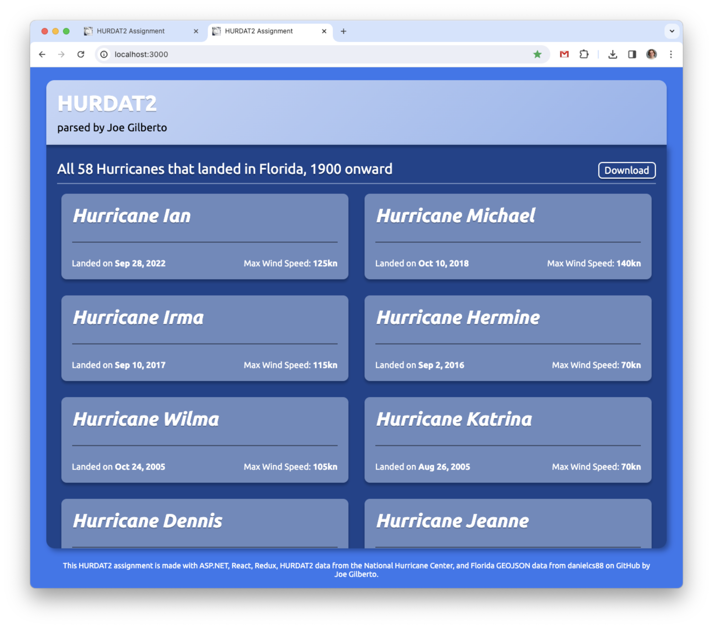
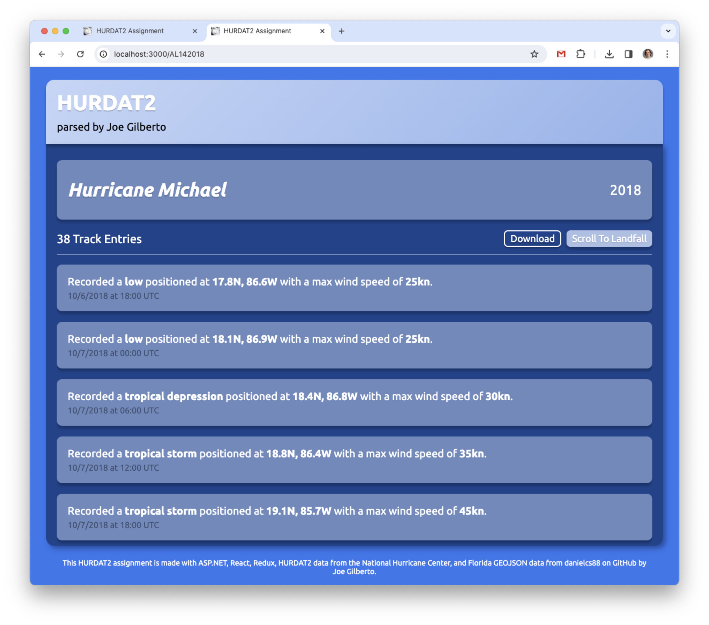

# HURDAT2 Assignment
A full-stack APS.NET/React web application that parses the [NHC](https://www.nhc.noaa.gov/data/)'s Best Track Data (HURDAT2) of [Atlantic hurricanes from 1851-2022](https://www.nhc.noaa.gov/data/hurdat/hurdat2-1851-2022-050423.txt) and returns a list of all huricanes that made landfall in Florida from 1900 onward.  Utilizes a React frontend with a Redux library making Axios API calls (deployed on Netlify), and a ASP.NET Core Web API backend deployed on Azure that parses the above .txt file and [Florida GeoJSON](https://raw.githubusercontent.com/danielcs88/fl_geo_json/master/fl-state.json).  Built by [Joe Gilberto](https://joekgilberto.com/).

## Deployment
Find the app deployed on Netlify, here: [https://hurdat2-assignment.netlify.app/](https://hurdat2-assignment.netlify.app/)

## Screenshots

### Index

As a user, I want to land on a well styiled home page with a list of all hurricanes that made landfall in Florida from 1900 onward.

### Show Hurricane

As a user, I want to be able to see more informaiton on a hurricane, along with a list of track entries associated with the hurricane.  I also want the track entry that marks landfall in Florida to be highlighted.

## Technologies Used
For the frontend, I utlized [React](https://react.dev/) components combined with a [Redux](https://redux.js.org/) library and [Axios](https://axios-http.com/) to make API calls to my backend.  My backend was built using [ASP.NET](https://dotnet.microsoft.com/en-us/apps/aspnet).

### Resources
Below are specific relevant resources I referenced while building this application.

- [A public domain hurricane image from Wikimedia](https://commons.wikimedia.org/wiki/File:Tropical_Cyclone_Jasper_(MODIS).jpg) that I used for the favicon.
- [The Redux documentation](https://commons.wikimedia.org/wiki/File:HomeSimple_svg.svg).

## Instructions for Local Deployment
The following instructions were used through macOS with a silicone M1 chip.

### Fork and clone
To deploy locally, fork and clone this repo.

### Install .NET 7.0
First, install .NET 7.0 here: [https://dotnet.microsoft.com/en-us/download/dotnet](https://dotnet.microsoft.com/en-us/download/dotnet)

### Add service dependencies
Navigate to the service directory.  Then, add the needed dependencies below:
```
dotnet add package Azure.Core
```
```
dotnet add package Microsoft.AspNetCore.OpenApi
```
```
dotnet add package Microsoft.EntityFrameworkCore
```
```
dotnet add package NetTopologySuite
```
```
dotnet add package Newtonsoft.Json
```
```
dotnet add package Swashbuckle.AspNetCore
```

### Spin up service server
For the final step of your service set up, spin up the server with the following command:
```
 dotnet run
```

### Install client dependencies
For the first step of your client set up, navigate into your client directory via your terminal and install your dependencies.
```
npm i
```

### Create frontend environmental variables
Next, create your environmental variables:
```
touch .env
```
Then, add your database environmental variables to interact with your service server (running on http://localhost:5153/hurricane/):
```
REACT_APP_HURRICANE_DEV_URL=http://localhost:5153/hurricane/
```

### Edit env vairable to dev
Navigate into your hurricane subdirectory of the utilities directory:
```
cd src/utilites/hurricane
```

Code in the hurricane-api.js file
```
code hurricane-api.js
```
And replace the production variable REACT_APP_HURRICANE_PROD_URL with REACT_APP_HURRICANE_DEV_URL on line 3.

### Spin up your client app
Finally, navigate back to the top level of your client directoy and spin up your app:
```
npm start
```

### Browse
Now, you can go to http://localhost:3000/ in your browser (Google Chrome is reccommended for best performance) and browse the application.

## Current User Flow
Firstly, visit [https://hurdat2-assignment.netlify.app/](https://hurdat2-assignment.netlify.app/)

From the index page, the user view prelimary infromation on all hurricanes that have made landfall in Florida from 1900 onward.  By clicking the "Download" button here, users can download a .txt file with a list of the hurricanes.  The user can then click on one of the hurricanes to navigate to it's show page, and view further details including track entry information.  By clicking the "Download" button here, users can download a .txt file of this hurricane and its track entries.
